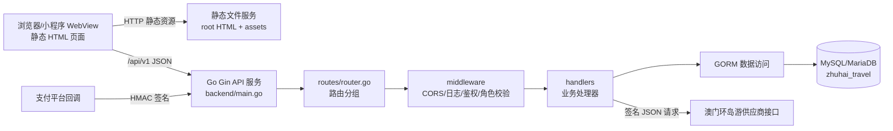
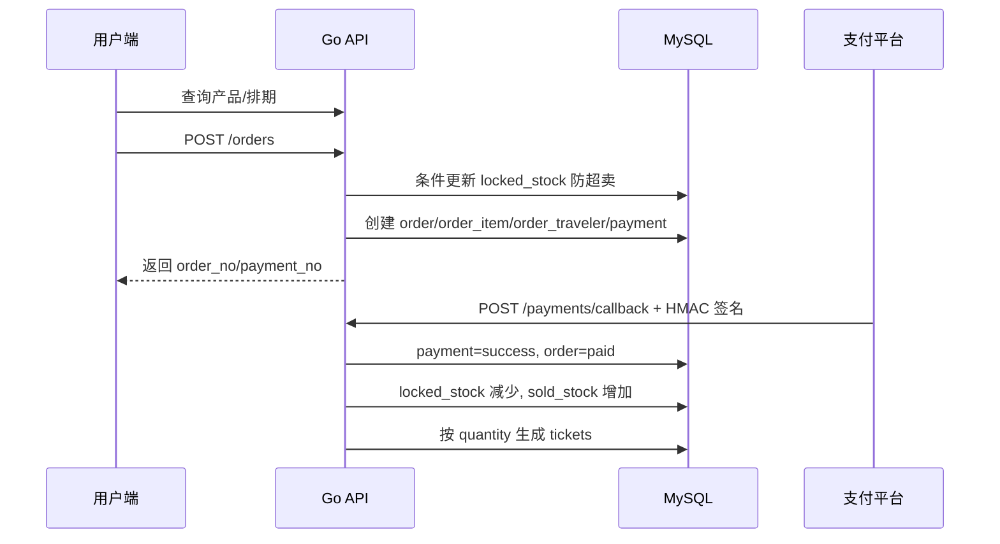

# 项目架构说明

## 1. 项目定位

本项目是一个珠海文旅本地生活平台原型，覆盖游客端产品浏览与购票、司机推广分销、后台运营管理，以及澳门环岛游供应商对接。当前形态是“静态多页面前端 + Go/Gin API 服务 + MySQL 兼容数据库”。前端页面可以直接由静态 Web 服务器托管，后端提供 `/api/v1` REST 接口，数据库通过 SQL 脚本初始化和演进。

## 2. 总体运行架构



后端没有单独的 service 层，业务编排主要集中在 `handlers/`。`models/` 只负责 GORM 映射，`dto/` 负责统一响应结构，`security/` 提供密码、Token、签名、脱敏等安全辅助能力。

## 3. 目录结构与职责

```text
.
├── *.html                       # 静态多页面前端原型
├── assets/                      # 图片、预览图、图标和页面视觉资产
├── database/                    # 根数据库初始化脚本和增量迁移
│   ├── 001_schema.sql
│   ├── 002_island_cruise.sql
│   ├── 003_island_cruise_operations.sql
│   ├── 004_driver_auth.sql
│   └── 005_island_cruise_code_content.sql
└── backend/
    ├── main.go                  # API 服务入口
    ├── config/                  # 环境变量加载
    ├── database/                # MySQL/GORM 初始化
    ├── dto/                     # 统一响应 DTO
    ├── handlers/                # 登录、产品、订单、票务、司机、后台、环岛游
    ├── middleware/              # CORS、日志、Bearer Token、角色校验
    ├── models/                  # GORM 实体
    ├── routes/                  # API 路由注册
    ├── security/                # bcrypt、HMAC JWT、签名校验、脱敏
    └── docs/                    # 后端架构与数据库细节文档
```

## 4. 前端架构

前端是无构建工具的静态 HTML 页面，每个页面内嵌 CSS 和 JavaScript：

- `index.html`：游客端首页，入口导航到船票、澳门游、香港游、租车、酒店等页面。
- `ticket.html`、`flow.html`：扫码购票和电子票流程原型。
- `island-cruise.html`、`island-cruise-booking.html`：澳门环岛游展示与真实接口购票流程。
- `driver.html`：司机注册、登录、钱包、佣金和提现入口。
- `admin.html`：超级管理员控制台，包含订单、轮播图、司机审核、佣金结算、提现处理等运营能力。
- `hotel-list.html`、`hotel.html`、`car.html`、`macau.html`、`hongkong.html`：独立品类或详情页面。

除 `admin.html`、`driver.html`、`island-cruise-booking.html` 外，大多数页面偏静态展示。`admin.html` 和 `driver.html` 通过 `window.ZHUHAI_API_BASE || "/api/v1"` 访问后端，并把 Bearer Token 与用户概况存储在 `localStorage`。`island-cruise-booking.html` 直接访问 `/api/v1/island-cruise` 下的供应商代理接口。

## 5. 后端分层

### 启动与配置

`backend/main.go` 调用 `config.Load()`、`database.Init(cfg)` 和 `routes.SetupRouter()`，最终监听 `0.0.0.0:${SERVER_PORT}`。配置加载会依次读取 `.env` 和 `backend/.env`，再落到内置默认值。关键变量包括：

- `SERVER_PORT`：默认 `8080`。
- `DB_HOST`、`DB_PORT`、`DB_USER`、`DB_PASSWORD`、`DB_NAME`：数据库连接。
- `JWT_SECRET`、`TOKEN_TTL_HOURS`：登录 Token。
- `CORS_ALLOWED_ORIGIN`：跨域白名单。
- `PAYMENT_WEBHOOK_SECRET`：支付回调签名密钥。
- `ISLAND_CRUISE_BASE_URL`、`ISLAND_CRUISE_DISTRIBUTOR_CODE`、`ISLAND_CRUISE_ACCESS_TOKEN`：环岛游供应商配置。

### 数据访问

`backend/database/mysql.go` 使用 GORM 连接 MySQL 兼容数据库，DSN 固定 `charset=utf8mb4`、`parseTime=True`、`loc=Asia/Shanghai`。连接池配置为最大空闲连接 10、最大打开连接 50、连接最长生命周期 1 小时。

### 路由与中间件

所有业务接口挂载在 `/api/v1`。全局中间件包括 CORS 和请求日志。鉴权使用自定义 HMAC-SHA256 JWT，`AuthRequired` 解析 `Authorization: Bearer <token>`，并把 `actor_id`、`actor_role`、`actor_name` 写入 Gin 上下文。管理员接口叠加 `AdminRoleRequired("super_admin")`，司机端接口叠加 `DriverStatusRequired("active")`。

### 响应格式

普通成功响应：

```json
{ "code": 200, "message": "ok", "data": {} }
```

失败响应：

```json
{ "code": 400, "message": "参数错误" }
```

分页响应：

```json
{ "code": 200, "message": "ok", "data": [], "total": 0, "page": 1, "size": 20 }
```

## 6. API 边界

### 公开接口

公开接口包括健康检查、用户手机号登录、司机注册/登录、管理员登录、产品列表、产品详情、分类、轮播图，以及环岛游航线和订单代理接口。支付回调也是公开路径，但必须通过 `X-Payment-Timestamp` 和 `X-Payment-Signature` 完成 HMAC 校验。

### 用户接口

用户接口需要 `role=user` 的 Bearer Token，覆盖个人资料、实名认证、出游人、收藏、发票抬头、订单创建、订单列表、票详情和核销历史查询。

### 司机接口

司机公开注册后进入 `pending_review` 状态。后台审核通过后，司机和车辆状态变为 `active`，并生成司机二维码。司机登录后可以查询个人资料、二维码、钱包、佣金明细、提现申请和提现历史。

### 管理员接口

管理员需要 `role=admin` 且数据库角色为 `super_admin`。后台能力包括运营看板、趋势数据、订单列表、退款处理、轮播图管理、司机审核、佣金结算、提现审核、系统参数和环岛游余额查询。

## 7. 数据模型

数据库名为 `zhuhai_travel`，字符集为 `utf8mb4`。项目文档建议本地使用 MySQL 8.4 LTS；后端文档也记录了 MariaDB 10.5 的部署形态，因此应保持 MySQL 兼容 SQL。

核心表按领域分组：

- 用户域：`users`、`travelers`、`user_favorites`、`invoice_titles`、`invoices`、`support_tickets`。
- 产品域：`product_categories`、`products`、`product_images`、`product_skus`、`product_schedules`、`banners`。
- 通用订单域：`orders`、`order_items`、`order_travelers`、`payments`、`refunds`。
- 票务域：`tickets`、`ticket_verifications`。
- 司机分销域：`drivers`、`vehicles`、`driver_qr_codes`、`driver_commissions`、`driver_withdrawals`。
- 运营审计域：`admin_users`、`audit_logs`。
- 环岛游供应商域：`island_cruise_orders`、`island_cruise_passengers`。

通用产品库存以 `product_schedules.total_stock - locked_stock - sold_stock` 表示可售库存。订单项保存产品标题、SKU 名称、价格和出行日期快照，避免后续产品配置变动影响历史订单。

## 8. 核心业务流程

### 8.1 通用产品下单与出票



`CreateOrder` 在事务内用条件更新锁库存：只有 `total_stock - locked_stock - sold_stock >= quantity` 时才增加 `locked_stock`。支付回调校验金额和签名后，在事务内完成支付记录、订单状态、库存转换和电子票生成。

### 8.2 核销与司机佣金

电子票通过 `qr_token_hash` 查询，管理员核销时将票状态从 `valid` 改为 `used`，写入 `ticket_verifications`。如果订单来源是司机二维码，且订单存在 `driver_id`，核销成功后按订单项金额和司机佣金率生成 `driver_commissions`。佣金默认先进入 `pending`，后台结算后改为 `settled`，司机可基于已结算余额发起提现。

### 8.3 司机推广链路

司机提交注册信息后，系统在事务内创建 `drivers` 和 `vehicles`，初始状态为 `pending_review`。超级管理员审核通过时，司机和车辆改为 `active`，并生成 `driver_qr_codes`。用户通过司机二维码下单时，订单来源标记为 `driver_qr`，后续核销成功才生成佣金，避免未履约订单产生分佣。

### 8.4 澳门环岛游供应商链路

环岛游流程独立于通用产品 SKU 库存体系，主要在 `handlers/island_cruise.go` 和 `island_cruise_*` 表中实现：

1. 前端查询港口、证件类型、航班、价格和日期推荐。
2. 锁座接口先创建本地 `island_cruise_orders` 和 `island_cruise_passengers`，再调用供应商 `lockOrderForNet`。
3. 锁座成功后订单进入 `pending_payment`，保存供应商订单号、票号、锁座响应和 10 分钟锁座过期时间。
4. 支付出票接口先校验本地状态、锁座有效期和预存款余额，再调用供应商 `saleOrderForNet`，成功后状态进入 `ticketed`。
5. 退票、改签、取消和订单查询会继续调用供应商接口，并把响应 JSON 回写到本地订单记录。
6. 供应商核销通知通过 `/api/v1/island-cruise/verify-notify` 回写本地核销状态。

供应商请求采用统一 envelope：`header` 放 distributor、timestamp 等字段，`body` 放业务参数。后端会对 header/body 做稳定 JSON 序列化，追加 `ISLAND_CRUISE_ACCESS_TOKEN` 后取 MD5，作为 `secretKey` 发送给供应商。

## 9. 安全设计

- 管理员和司机密码使用 bcrypt，新密码应始终走 `security.HashPassword`。
- 登录 Token 是项目内自定义 HMAC-SHA256 JWT，依赖 `JWT_SECRET`；生产环境必须替换默认值。
- 支付回调使用 `PAYMENT_WEBHOOK_SECRET` 对 `timestamp.body` 做 HMAC-SHA256 校验。
- 前端后台和司机页把 Token 存储在 `localStorage`，部署时需要 HTTPS、合理 CORS、短 Token 有效期和必要的 XSS 防护。
- 身份证号、证件号字段在 SQL 中使用 `VARBINARY(255)` 预留加密存储，但当前处理器主要实现输出脱敏；如进入生产，应补齐字段级加密和密钥轮换方案。
- `.env` 和 `backend/.env` 不应提交，使用 `.env.example` 和 `backend/.env.example` 作为模板。

## 10. 部署与运行

本地后端运行：

```bash
cd backend
go mod download
go run .
```

后端构建：

```bash
cd backend
go build -o server .
```

前端静态预览：

```bash
python3 -m http.server 8000
```

数据库初始化：

```bash
mysql -u root < database/001_schema.sql
mysql -u root zhuhai_travel < database/002_island_cruise.sql
mysql -u root zhuhai_travel < database/003_island_cruise_operations.sql
mysql -u root zhuhai_travel < database/004_driver_auth.sql
mysql -u root zhuhai_travel < database/005_island_cruise_code_content.sql
```

生产部署通常可以把根目录静态文件交给 Nginx 托管，并将 `/api/v1` 反向代理到 Go 后端。后端服务需要连接 MySQL 兼容数据库，并配置支付回调、CORS 和环岛游供应商凭据。

## 11. 当前架构约束与演进建议

- `handlers/` 同时承担控制器和业务服务职责。随着支付、退改、分佣复杂度提高，建议拆出 `services/`，把事务和状态机逻辑从 HTTP 绑定中分离。
- 数据库迁移目前由 SQL 文件手动执行。多人协作或生产发布时，建议引入迁移工具并记录已执行版本。
- 支付回调、退款和环岛游上游请求需要更强的幂等保护，目前主要依赖状态判断和唯一字段。
- 通用订单和环岛游订单是两套流程。若后续统一到一个订单中心，需要设计供应商订单适配层和统一支付/退款抽象。
- 当前没有自动化测试文件。建议优先覆盖 `security`、认证中间件、库存锁定、支付回调、票务核销、环岛游状态迁移等高风险路径。
